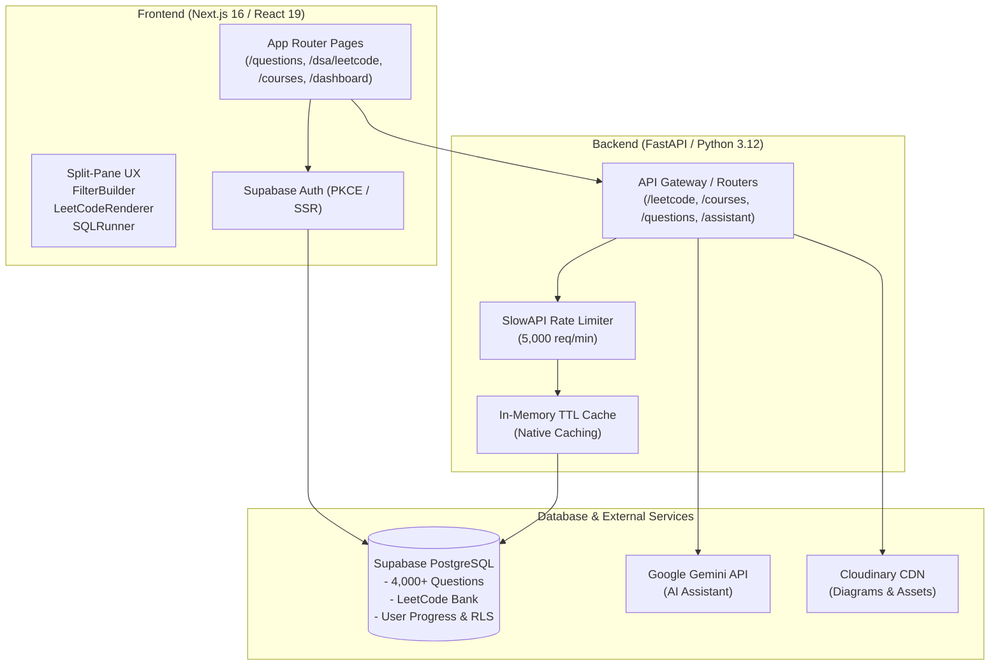

# Interview Prep Platform

> **A full-stack, production-grade software engineering interview preparation platform featuring 4,000+ curated FAANG questions, interactive system design & SQL courses with in-browser query execution, and real-time algorithmic problem solving.**

[](https://nextjs.org/)
[](https://react.dev/)
[](https://www.typescriptlang.org/)
[](https://fastapi.tiangolo.com/)
[](https://www.python.org/)
[](https://supabase.com/)
[](https://tailwindcss.com/)

---

## 🌐 Live Deployments

- **Web Application**: [https://interview-prep-kappa-sandy.vercel.app](https://interview-prep-kappa-sandy.vercel.app)
- **API Backend**: [https://interview-prep-q3b8.onrender.com](https://interview-prep-q3b8.onrender.com)
- **Test Credentials**: `portaluser88@gmail.com` / `Password99!` (or sign in via Google OAuth / Magic Link)

---

## 📌 Overview

Preparing for software engineering interviews often requires juggling fragmented tools—one for coding problems, another for system design diagrams, and separate sandboxes for database queries.

**Interview Prep Platform** consolidates interview preparation into a single unified web application. It combines high-volume company-tagged question banks, end-to-end interactive engineering curriculums (System Design, GenAI, ML, Mobile, OOD, and SQL), an in-browser database execution engine, and real-time study analytics backed by a high-performance Next.js 16 + FastAPI architecture.

---

## 🚀 Key Features

### 1. Curated Question Bank (`/questions`)
- **4,000+ Company-Tagged Questions**: Filterable questions curated across top technology companies including Google, Meta, Amazon, Microsoft, Apple, and Netflix.
- **FilterBuilder Engine**: Multi-condition search filtering supporting `Match All` and `Match Any` logic across difficulty, company tags, topic domains, and completion status.
- **Split-Pane Explorer**: Keyboard-navigable master-detail view with dynamic autocomplete suggestions, active row highlighting, and instant preview rendering.
- **Study Collections**: One-click bookmarking to personalized **Custom Folders** and a dedicated **Revisit Queue**.

### 2. LeetCode DSA Explorer & Multi-Language Solver (`/dsa/leetcode`)
- **4,017 Algorithmic Problems**: Complete LeetCode dataset with real-time search and smooth, auto-loading infinite scroll.
- **LaTeX Math Normalization**: Custom renderer converting complex asymptotic notations ($O(N)$, exponents $10^4$, subscripts, matrix formulas) into clear typography.
- **Structured Examples & Constraints**: High-contrast code callouts with test case breakdowns and constraint badges.
- **Collapsible Solution Approaches**: Detailed step-by-step intuition proofs with Time ($O(N)$) and Space ($O(1)$) complexity badges.
- **Multi-Language Code Implementation**: Integrated code viewer supporting **Python, Java, C++, TypeScript, Go, and JavaScript** with syntax highlighting and one-click copy.

### 3. Interactive Courses & In-Browser SQL Runner (`/courses`)
- **6 Full Technical Curriculums**:
  - **System Design** (30 Chapters): Architectural fundamentals, distributed caching, load balancing, message queues, and real-world system case studies.
  - **Generative AI System Design** (11 Chapters): LLM serving architectures, RAG pipelines, vector databases, and agent orchestration.
  - **Machine Learning System Design** (11 Chapters): Feature pipelines, model training at scale, inference optimization, and monitoring.
  - **Mobile System Design** (11 Chapters): Offline-first sync, battery/network efficiency, caching, and client architectures.
  - **Object-Oriented Design** (14 Chapters): Design patterns, SOLID principles, and object modeling exercises.
  - **Interactive SQL Course** (21 Chapters): Query execution exercises ranging from basic filtering to advanced joins, aggregations, and window functions.
- **Live SQL Sandbox**: Integrated browser-based SQLite execution environment seeded with real schemas (`Movies`, `BoxOffice`, `Buildings`, `Employees`) offering instant query validation and interactive tabular results.

### 4. Progress Tracking & Performance Analytics (`/dashboard`, `/progress`)
- **Real-Time Metrics**: Automated calculations of completion ratios across difficulty levels (Easy, Medium, Hard).
- **Company Readiness Meters**: Visual readiness scores tailored to target hiring pipelines.
- **Consistency Tracking**: Day streak calculations, activity calendars, and recent practice history logs.

### 5. Enterprise Authentication & Security (`/login`, `/auth/callback`)
- **Supabase Auth**: Secure authentication supporting Google OAuth and passwordless magic links via PKCE token exchange.
- **Session Protection**: Server-side route validation via Next.js App Router Middleware.
- **API Defense**: Integrated rate limiting via SlowAPI (5,000 requests/min ceiling) and strict CORS origin validation.

---

## 🛠️ Tech Stack

| Layer | Technologies |
| :--- | :--- |
| **Frontend** | Next.js 16 (App Router, Turbopack), React 19, TypeScript 5, Tailwind CSS v4, Lucide React, DOMPurify |
| **Backend** | Python 3.12, FastAPI, Uvicorn, Pydantic v2, SlowAPI |
| **Database & Auth** | Supabase (PostgreSQL with Row Level Security, Supabase Auth with PKCE) |
| **AI Integration** | Google Gemini API (SSE streaming doubt-clearing assistant) |
| **Media & Storage** | Cloudinary (User avatars and architectural diagram storage) |
| **Hosting & CI/CD** | Vercel (Frontend edge deployment), Render (FastAPI web service) |

---

## 🏗️ System Architecture



---

## 📂 Folder Structure

```
interview-prep/
├── interview-app/
│   ├── backend/
│   │   ├── middleware/          # Rate limiting & security middlewares
│   │   ├── models/              # Pydantic schemas & response models
│   │   ├── routes/              # FastAPI endpoints (auth, courses, leetcode, questions, etc.)
│   │   ├── services/            # Business logic (Gemini, questions, Supabase client)
│   │   ├── main.py              # FastAPI application entry point & CORS configuration
│   │   ├── requirements.txt     # Pinned Python production dependencies
│   │   └── .env.example         # Backend environment variables template
│   ├── frontend/
│   │   ├── src/
│   │   │   ├── app/             # Next.js 16 App Router pages & layouts
│   │   │   │   ├── courses/     # Interactive courses & SQL playground
│   │   │   │   ├── dashboard/   # User statistics & readiness tracking
│   │   │   │   ├── dsa/         # LeetCode DSA explorer & detail views
│   │   │   │   ├── login/       # Authentication page
│   │   │   │   ├── progress/    # Detailed completion analytics
│   │   │   │   ├── questions/   # Company questions split-pane explorer
│   │   │   │   └── revisit/     # Custom folders & revision queue
│   │   │   ├── components/      # Reusable UI widgets (FilterBuilder, LeetCodeRenderer, SQLRunner)
│   │   │   └── lib/             # Supabase client helpers & runtime configuration
│   │   ├── package.json         # Node.js dependencies & scripts
│   │   └── .env.example         # Frontend environment variables template
│   ├── migrations/              # Supabase SQL schema migrations & RLS policies
│   ├── scripts/                 # Data loading scripts (LeetCode & course ingesters)
│   └── supabase_setup.sql       # Initial database bootstrap script
└── README.md                    # Project documentation
```

---

## ⚡ Getting Started

### Prerequisites
- **Node.js**: `v18.17.0+` (Node 20+ recommended)
- **Python**: `3.11` or `3.12`
- **Supabase Account**: For database, auth, and storage

---

### 1. Clone the Repository
```bash
git clone https://github.com/saicharanyadavalli/interview-prep.git
cd interview-prep/interview-app
```

---

### 2. Backend Setup

1. **Navigate to the backend directory and create a virtual environment**:
   ```bash
   cd backend
   python -m venv .venv
   
   # On macOS/Linux:
   source .venv/bin/activate
   # On Windows:
   .venv\Scripts\activate
   ```

2. **Install dependencies**:
   ```bash
   pip install -r requirements.txt
   ```

3. **Configure environment variables**:
   ```bash
   cp .env.example .env
   ```
   Fill in your `.env` with your credentials:
   ```ini
   SUPABASE_URL=https://your-project.supabase.co
   SUPABASE_ANON_KEY=your-supabase-anon-key
   SUPABASE_SERVICE_KEY=your-supabase-service-role-key
   GEMINI_API_KEY=your-gemini-api-key
   GOOGLE_CLIENT_ID=your-google-client-id
   CLOUDINARY_CLOUD_NAME=your-cloudinary-cloud-name
   CLOUDINARY_API_KEY=your-cloudinary-api-key
   CLOUDINARY_API_SECRET=your-cloudinary-api-secret
   ```

4. **Start the FastAPI backend server**:
   ```bash
   uvicorn main:app --reload --port 8000
   ```
   The backend API will be running at `http://localhost:8000` (Swagger docs at `http://localhost:8000/docs`).

---

### 3. Frontend Setup

1. **Navigate to the frontend directory**:
   ```bash
   cd ../frontend
   ```

2. **Install Node dependencies**:
   ```bash
   npm install
   ```

3. **Configure environment variables**:
   ```bash
   cp .env.example .env.local
   ```
   Edit `.env.local`:
   ```ini
   NEXT_PUBLIC_SUPABASE_URL=https://your-project.supabase.co
   NEXT_PUBLIC_SUPABASE_ANON_KEY=your-supabase-anon-key
   NEXT_PUBLIC_API_URL=http://localhost:8000
   ```

4. **Start the development server**:
   ```bash
   npm run dev
   ```
   Open [http://localhost:3000](http://localhost:3000) in your browser.

---

### 4. Database Initialization

1. Open your **Supabase Dashboard** -> **SQL Editor**.
2. Run the `interview-app/supabase_setup.sql` script to create core database tables and Row Level Security policies.
3. Run the migrations in `interview-app/migrations/` (e.g. `005_leetcode_tables.sql`) to set up LeetCode and courses schemas.
